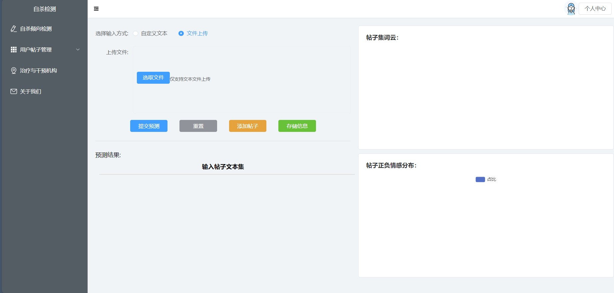
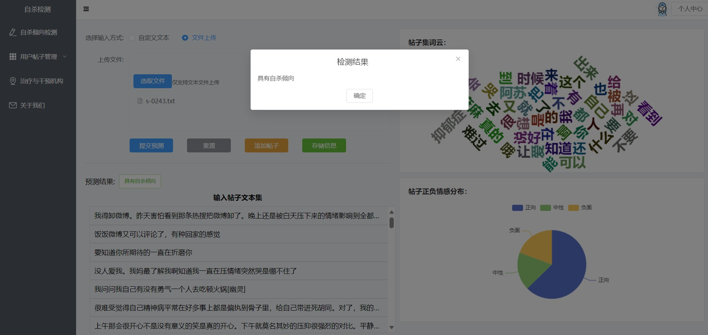
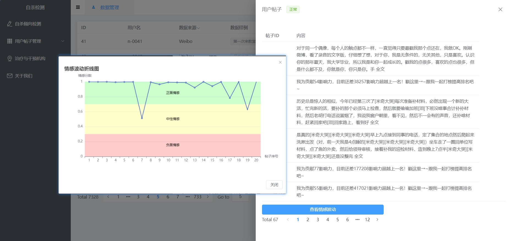
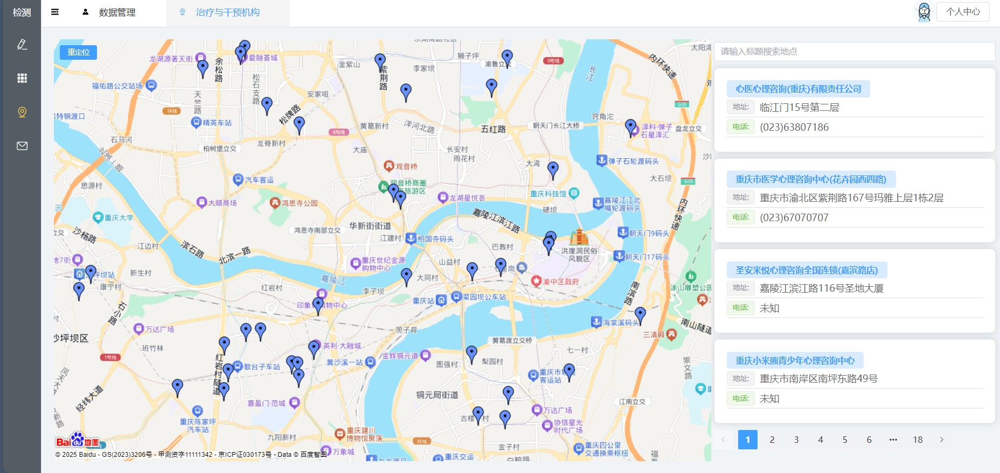

# 自杀倾向检测系统（FastAPI, Vue3, MongoDB）

## 概述

该系统使用FastAPI作为后端，Vue3作为前端，MongoDB作为数据库，用于检测自杀倾向。

## 步骤 1：将 `map_data` 导入到 MongoDB

在启动系统之前，请确保将 `map_data` 文件导入到MongoDB。MongoDB中的集合名称应该与FastAPI请求数据库时使用的名称一致。

## 步骤 2：启动 FastAPI 后端

从连接中通过网盘分享的文件
链接: https://pan.baidu.com/s/1zYEAHOPDWWsuHMneokmYmA  提取码: ****
下载模型预训练文件，放在文件\sui_fastapi\model目录下命名为model.pth

要启动FastAPI后端，运行以下命令：

```bash
uvicorn main:app --reload
```

此命令将启动后端服务器，并在开发过程中启用自动重载。

## 步骤 3：启动 Vue3 前端

### 安装前端所需的库

首先，需要安装Vue3前端所需的库。运行以下命令来安装所有必要的包：

```bash
npm install
```

确保您的环境和配置与要求一致。

### 启动 Vue3 开发服务器

安装完成后，您可以通过运行以下命令启动开发服务器：

```bash
npm run dev
```

这将启动Vue3前端，如果所有配置正确，它将与FastAPI后端连接。

## 系统示意图









## 其他信息

1. 确保后端（FastAPI）和前端（Vue3）都已正确配置，并可以通过正确的URL和API端点进行通信。
2. 如果遇到MongoDB连接问题，请检查FastAPI后端的配置，确保与MongoDB数据库的连接已正确建立。
